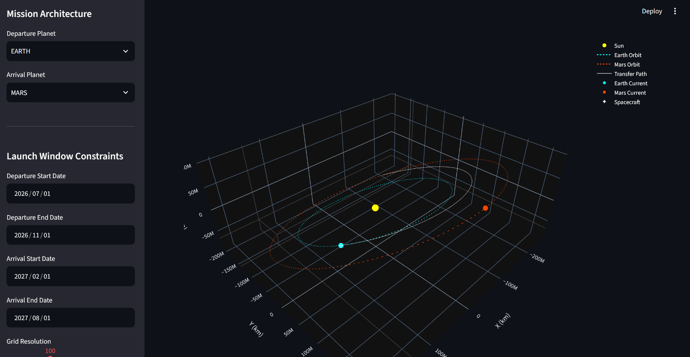
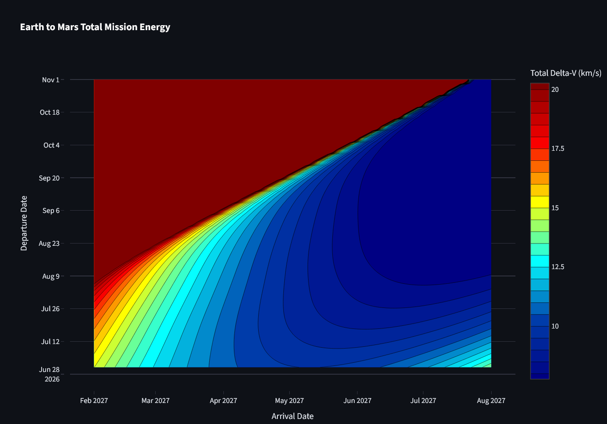

# Interplanetary Mission Architect

A professional-grade astrodynamics trajectory planner that bridges a high-performance C++ physics engine with an interactive Python/Streamlit frontend. This tool calculates optimal interplanetary launch windows, generates detailed porkchop plots, and renders 3D mission geometries for any planet in the solar system.


## Features

* **High-Performance Grid Search:** A custom C++ backend executes thousands of Lambert solver iterations per second to map out mission energy requirements.
* **Generalized Solar System Support:** Powered by NASA SPICE ephemerides (`spiceypy`), allowing trajectory optimization between any celestial bodies (e.g., Earth to Jupiter, Venus to Mars).
* **Interactive Porkchop Plots:** Visualizes Total $\Delta V$ contours. Hovering over data points reveals mission-critical metrics including Departure Characteristic Energy ($C_3$) and Arrival Excess Velocity ($v_\infty$).



* **Dynamic 3D Visualization:** Click any point on the porkchop plot—or use the Auto-Optimizer button—to instantly render the interactive 3D transfer path, complete with planetary positions and orbital arcs.
* **Realistic Mission Profiles:** Calculates propellant requirements based on specific mission architectures:
    * **Low Circular Orbit (LCO):** Standard fully propulsive capture.
    * **Highly Elliptical Orbit (HEO):** Deep space capture with configurable periapsis.
    * **Aerocapture / Direct Entry:** Atmospheric braking yielding zero arrival propellant cost.
* **Data Export:** Download the 100-step 3D trajectory waypoint arrays as a CSV for use in external rendering software (Blender), flight simulators (KSP/kOS), or advanced mission design tools (GMAT).

## Tech Stack

* **Backend:** C++17, Eigen3 (Linear Algebra)
* **Language Bridge:** Pybind11
* **Frontend:** Python 3.14.4, Streamlit
* **Data & Visualization:** NumPy, Pandas, Plotly, SpiceyPy

## Project Structure

```text
├── CMakeLists.txt              # C++ Build configuration
├── include/                    # C++ Headers
│   ├── LambertSolver.hpp
│   ├── KeplerPropagator.hpp
│   ├── PatchedConic.hpp
│   └── TrajectoryOptimizer.hpp
├── src/                        # C++ Source Files
│   ├── LambertSolver.cpp
│   ├── KeplerPropagator.cpp
│   ├── PatchedConic.cpp
│   ├── TrajectoryOptimizer.cpp
│   └── bindings.cpp            # Pybind11 bridge
├── pythonApp/                  # Frontend Application
│   ├── app.py                  # Streamlit dashboard
│   ├── ephemeris.py            # SPICE kernel manager
│   ├── planet_data.py          # Central registry for planetary constants (mu, radius)
│   └── kernels/                # Directory for NASA SPICE kernels (e.g., de432s.bsp)
